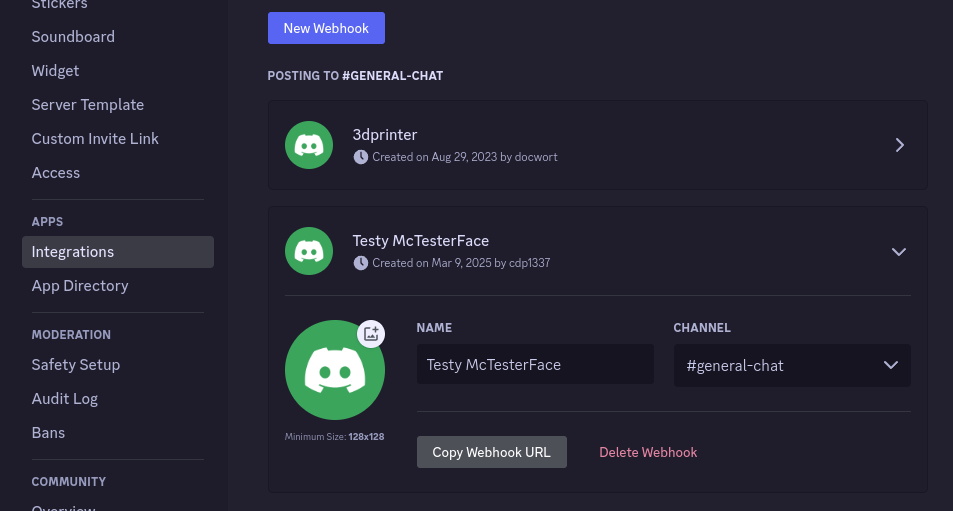

# Tools for installing ARK Survival Ascended Dedicated Server on Linux

Wanna chat?

[](https://discord.gg/48hHdm5EgA)

Help fund the project

[](https://ko-fi.com/Q5Q013RM9Q)


## What does it do?

This script will:

* Download Proton from Glorious Eggroll's build
* Install Steam and SteamCMD
* Create a `steam` user for running the game server
* Install ARK Survival Ascended Dedicated Server using standard Steam procedures
* Setup a systemd service for running the game server
* Add firewall service for game server (with firewalld or UFW)
* Setup NFS shares for multi-server environments
* Adds a management script for controlling your server
* Adds backup/restore scripts for archiving and migrating data

---

## Requirements

* Basic familiarity with running commands in Linux.
* Debian or Ubuntu
* At least 40GB free disk space (an SSD is strongly recommended)
* 16GB RAM per map or 96GB RAM for a full cluster
* CPU/vCPU cores, at least 2 cores per map and 4GHz or faster.

## Installation on Debian 12 or Ubuntu 24.04

To install ARK Survival Ascended Dedicated Server on Debian 12 or Ubuntu 24.04,
download and run [server-install-debian12.sh](dist/server-install-debian12.sh)
as root or sudo.

* Debian 12 tested on Digital Ocean, OVHCloud, and Proxmox.
* Ubuntu 24.04 tested on Proxmox.
* Ubuntu 22.04 tested on Proxmox.

Quick run (if you trust me, which of course you should not):

```bash
sudo su -c "bash <(wget -qO- https://raw.githubusercontent.com/cdp1337/ARKSurvivalAscended-Linux/main/dist/server-install-debian12.sh)" root
```

### Advanced Usage

Download the script and retain for later management use.

```bash
wget https://raw.githubusercontent.com/cdp1337/ARKSurvivalAscended-Linux/main/dist/server-install-debian12.sh
chmod +x server-install-debian12.sh

# Reset and rebuild proton directories (if the prefix gets corrupted somehow)
sudo ./server-install-debian12.sh --reset-proton

# Force reinstall game binaries, (useful after a major update when Wildcard breaks the build)
# This will NOT remove your save data!
sudo ./server-install-debian12.sh --force-reinstall
```

Re-running the installation script on an existing server **is safe** and will **not** overwrite 
or delete your existing game data.  To install new features as they come out, simply
re-download the script installer via the steps above and re-run the installer application.


## Finding Your Game

Once installed and running, you should be able to search for your server
in the "Unofficial" server list after ticking "Show Player Servers".


(This was an added step Wildcard implemented to make it harder for players to find servers
that are hosted outside Nitrado's network...)


## Features

Because it's managed with systemd, standardized commands are used for managing the server.
This includes an auto-restart for the game server if it crashes.

By default, enabled game maps will **automatically start at boot**!

A start and stop script is included in `/home/steam/ArkSurvivalAscended`
for starting and stopping all maps, (not to mention updating before they start).

Sets up multiple maps on a single install, and **all of them can run at the same time**
(providing your server has the horsepower to do so).

If your single server cannot run all maps, this script supports multiple servers
sharing the same `cluster` directory via NFS to allow players to jump between maps,
even if they are on different physical servers.


## Directory Structure

```
/home/steam/ArkSurvivalAscended
├── AppFiles/                  # Game Server Files (directly managed from Steam)
├── prefixes/                  # Proton prefix directory (emulates windows filesystem)
│   ├── ark-aberration/
│   ├── ark-club/
│   ├── ark-island/
│   ├── ark-scorched/
│   ├── ark-thecenter/
│   ├── ark-extinction/
│   └── ark-astraeos/
├── services/                  # Service file overrides (for setting startup options)
│   ├── ark-aberration.conf
│   ├── ark-club.conf
│   ├── ark-island.conf
│   ├── ark-scorched.conf
│   ├── ark-thecenter.conf
│   ├── ark-extinction.conf
│   └── ark-astraeos.conf
├── GameUserSettings.ini       # Game Server Configuration
├── Game.ini                   # Game Server Configuration
├── ShooterGame.log            # Game log file
├── PlayersJoinNoCheckList.txt # Player whitelist
├── admins.txt                 # Admin whitelist (needs manually setup)
├── start_all.sh               # Start all maps
├── stop_all.sh                # Stop all maps
├── backup.sh                  # Backup game files to local archive
├── restore.sh                 # Restore game files from archive
├── update.sh                  # Update game files (only when all maps stopped)
└── manage.py                  # Management console for game server, maps, and settings
```


## Managing your Server (Easy Method)

Once installed, run `sudo /home/steam/ArkSurvivalAscended/manage.py` to access the management console:

```
== Welcome to the ARK Survival Ascended Linux Server Manager ==

| # | Map              | Session                    | Port | RCON  | Auto-Start | Service | Players |
| 1 | ScorchedEarth_WP | VN Test Boxes (Scorched)   | 7704 | 27004 | Enabled    | Stopped | N/A     |
| 2 | TheIsland_WP     | VN Test Boxes (Island)     | 7701 | 27001 | Disabled   | Stopped | N/A     |
| 3 | TheCenter_WP     | VN Test Boxes (TheCenter)  | 7705 | 27005 | Disabled   | Stopped | N/A     |
| 4 | Astraeos_WP      | VN Test Boxes (Astraeos)   | 7707 | 27007 | Disabled   | Stopped | N/A     |
| 5 | Aberration_WP    | VN Test Boxes (Aberration) | 7702 | 27002 | Disabled   | Stopped | N/A     |
| 6 | Extinction_WP    | VN Test Boxes (Extinction) | 7706 | 27006 | Disabled   | Stopped | N/A     |
| 7 | BobsMissions_WP  | VN Test Boxes (Club)       | 7703 | 27003 | Disabled   | Stopped | N/A     |

1-7 to manage individual map settings
Configure: [M]ods | [C]luster | [A]dmin password/RCON | re[N]ame | [D]iscord integration
Control: [S]tart all | s[T]op all | [R]estart all | [U]pdate
or [Q]uit to exit
```

The main screen of the management UI shows all maps and some basic info, 
including how many players are currently connected.

### Mods management

Pressing `m` will open the mods overview screen:

```
== Mods Configuration ==

| Session                    | Mods    |
| VN Test Boxes (Scorched)   |         |
| VN Test Boxes (Island)     |         |
| VN Test Boxes (TheCenter)  |         |
| VN Test Boxes (Astraeos)   |         |
| VN Test Boxes (Aberration) |         |
| VN Test Boxes (Extinction) |         |
| VN Test Boxes (Club)       | 1005639 |

[E]nable mod on all maps | [D]isable mod on all maps | [B]ack:
```

Here, `e` will allow you to enable a mod on all maps and `d` will disable a mod on all maps.

`b` will go back to the main menu overview.

### Cluster management

Pressing `c` will open the cluster overview screen:

```
== Cluster Configuration ==

| Session                    | Cluster ID     |
| VN Test Boxes (Scorched)   | some-test-name |
| VN Test Boxes (Island)     | some-test-name |
| VN Test Boxes (TheCenter)  | some-test-name |
| VN Test Boxes (Astraeos)   | some-test-name |
| VN Test Boxes (Aberration) | some-test-name |
| VN Test Boxes (Extinction) | some-test-name |
| VN Test Boxes (Club)       | some-test-name |

[C]hange cluster id on all maps | [B]ack:
```

Pressing `c` on the cluster page will allow you to set the cluster ID for all maps.

`b` will go back to the main menu overview.

### Admin password and RCON management

Pressing `a` will open the admin password and RCON management screen:

```
== Admin and RCON Configuration ==

| Session                    | Admin Password | RCON  |
| VN Test Boxes (Scorched)   | foobarblaz     | 27004 |
| VN Test Boxes (Island)     | foobarblaz     | 27001 |
| VN Test Boxes (TheCenter)  | foobarblaz     | 27005 |
| VN Test Boxes (Astraeos)   | foobarblaz     | 27007 |
| VN Test Boxes (Aberration) | foobarblaz     | 27002 |
| VN Test Boxes (Extinction) | foobarblaz     | 27006 |
| VN Test Boxes (Club)       | foobarblaz     | 27003 |

[C]hange admin password on all | [E]nable RCON on all | [D]isable RCON on all | [B]ack:
```

This allows you to change the admin/rcon password across all maps, as well as enable or disable RCON.

Note, you should leave RCON enabled, as it allows the script to warn users upon restarts and 
gracefully save prior to shutting down the server. 


### Discord Integration (New feature as of 2025.03.10)

```
== Discord Integration ==

Discord integration is currently available and enabled!

Discord Webhook URL:  https://canary.discord.com/api/webhooks/1348175098775081070/xjCt************
Discord Channel ID:   919624281904783472
Discord Guild ID:     909843670214258729
Discord Webhook Name: Testy McTesterFace

[D]isable | [C]hange Discord webhook URL | configure [M]essages | [B]ack
```

Provides an option to automatically send messages to Discord on start, restart, and stop
events for maps.  Default messages provided, and can be customized to match your preferences.

To setup Discord integration, grab a webhook URL from Discord by browsing to 
Server Settings -> Integrations


Then Webhooks


And create a new webhook and configure as desired.



Copy the webhook URL and paste into the management console when prompted.


### Renaming maps

From the main menu overview, pressing `n` will allow you to rename all maps.
By default, all maps are suffixed with the map name, allowing you to have the same name
for every map in the cluster.

### Stopping / Starting / Restarting

From the main menu overview, the options `s`, `t`, and `r` respectively
will **s**tart, s**t**op, and **r**estart all maps that are currently enabled.

When RCON is enabled and available, (default), the stop logic will first check if there are 
any players currently on the map.  If there are, it will send a 5-minute warning to all players
and then wait for a minute before another warning is sent if they are still logged in.


3 minutes, 2 minutes, 1 minute, and 30 second warnings are also sent.

If all players have left the map prior to the countdown completing, 
the server will skip the remaining countdown and will proceed with the shutdown.

A world save is automatically requested on the map prior to shutdown.

**New as of 2025.03.10 release**, Discord messages are sent prior to shutdown and after startup.

### Updating

If all maps are stopped, the `u` option will update the game server files from Steam.

### Managing individual maps

Pressing 1 through (however many maps there are), will open the individual map page.

```
Map:           ScorchedEarth_WP
Session:       VN Test Boxes (Scorched)
Port:          7704
RCON:          27004
Auto-Start:    Yes
Status:        Stopped
Players:       None
Mods:          
Cluster ID:    some-test-name
Other Options: AllowFlyerCarryPvE=True?DinoDamageMultiplier=25
Other Flags:   -servergamelog     

[E]nable | [D]isable | [M]ods | [C]luster | re[N]ame | [F]lags | [O]ptions | [S]tart | s[T]op | [R]estart | [B]ack:
```

This page allows you to configure a specific map, notably enabling, disabling, and configuring flags and options.

Options are any variable as defined in the [Server Configuration](https://ark.wiki.gg/wiki/Server_configuration)
and flags are command line arguments (ie: those that start with a `-`.)


## Backups and Migrations

As of 2025.05.05, simple backup and restore scripts have been added to `/home/steam/ArkSurvivalAscended/`

Backups are just a tarball of the game map, user data, tribe data, and configuration files.
You can use your native archive manager to view these files, or 7-zip, winrar, etc.

```bash
./backup.sh 
Created backup /home/steam/ArkSurvivalAscended/backups/ArkSurvivalAscended-2025-05-05_13-04.tgz
```

To migrate this game data to another server running this system, you can copy that tarball to
`/home/steam/ArkSurvivalAscended/backups/` (or somewhere that makes sense to you),
and run:

```bash
./restore.sh backups/ArkSurvivalAscended-2025-05-05_09-05.tgz 
Extracting backups/ArkSurvivalAscended-2025-05-05_09-05.tgz
Restoring service files
Ensuring permissions
```

Feel free to read through [some advanced usages](docs/advanced-usage.md) for more information on
how things work behind the scenes.


## Accessing Files

The game starts as a system user and thus `root` or an admin account must be used
to start/stop/mange the server.  Accessing the files however should be done with the `steam` user.

[Read some tips on accessing game files via SSH](docs/access-files-sftp.md). 

## Common Issues and Troubleshooting

### Server Memory

**Problem**

Server starts but can never be connected to and RCON can never connect.

**Details**

ARK: SA server takes a **LOT** of memory to run, so the most common issue is server out of memory.
For example, a fresh install of The Island takes about 11GB of RAM and an established instance with some history
can easily balloon to 22GB of memory.

The most recent build of this library includes checks for this issue, and will warn you when browsing to a map:

```
== Service Details ==

Map:           TheCenter_WP
Session:       Test ARK Server (TheCenter)
Port:          7705
RCON:          27005
Auto-Start:    No
Status:        Stopped
Players:       None
Mods:          
Cluster ID:    
Other Options: 
Other Flags:   -servergamelog  

❗⛔❗ WARNING - Service was recently killed by the OOM killer
This may indicate that your server ran out of memory!
```

**Fix**

Install more memory or reduce the number of maps running at a time.

### Mod Partially Downloaded

**Problem**

A mod was recently updated and the server will not start.

**Details**

It's possible that a mod was only partially downloaded from Curseforge.
The game server may see the mod was present and will skip validation check that it was actually fully downloaded.

**Fix**

To resolve this, remove the incomplete mod from `/home/steam/ArkSurvivalAscended/AppFiles/ShooterGame/Binaries/Win64/ShooterGame/Mods/`
and try restarting the game server.
(It's up to you to determine which mod is causing issues unfortunately.)

### Wildcard Botched Steam

**Problem**

New major version released and the server will not start.

**Details**

Occasionally after a major update in the game server, the Steam tracking meta can get corrupted / confused.
If there recently was a major update and your server just won't start, try force-reinstalling the binaries.

**Fix**

`sudo ./server-install-debian12.sh --force-reinstall` can reinstall all binaries while preserving player and map data.

### Cannot See Server (NAT)

**Problem**

Server is not visible in the server list.

**Details**

Game servers running on a box with a public IP should immediately be visible in the server list
with no additional work required.

For servers running on a private network, try to connect directly to verify the game server is working
by opening the game and pressing backtick (key above TAB beside 1 on a QWERTY keyboard) and type:

```
open 192.168.0.0:7701
```

(replacing the IP and port number with the actual IP and port of your map)

**important**, this only works if you are on the same network as the server or have access
via a VPN to the server network.

**Fix**

For servers on a private network that you can connect to directly, you will need to configure port forwarding on your gateway.
Add the ports to forward, (7701-7707 UDP) to forward to your internal IP.

If you want to forward RCON as well, repeat for the requested map (27001-27007 TCP).


### Cannot Connect to Server (NAT)

**Problem**

Server is visible in the server list but cannot connect to it.

**Details**

If you have added NAT forwarding and can see the server in the list but cannot connect to it
while inside the same network, your gateway may have an issue with NAT reflection.

Try connecting to the server directly via its internal IP address by opening the game
and pressing backtick (key above TAB beside 1 on a QWERTY keyboard) and type:

```
open 192.168.0.0:7701
```

(replacing the IP and port number with the actual IP and port of your map)

If you can connect directly and the map is visible in the list but you cannot connect via the list,
your gateway most likely does not support NAT loopbacks.  This is very common with home wifi routers
and residential ISP-provided equipment.

**Fix**

Research if your router supports NAT reflection/loopback and enable it if possible.

Sadly most ISP-provided equipment is absolute garbage and does not provide this feature,
so the only options are to switch your router to passthrough mode and buy a better router
or continue to use the direct connect method.

## Utilized libraries

* [RCON library by Conqp](https://github.com/conqp/rcon) (GPLv3)
* [Scripts Collection compiler by eVAL](https://github.com/eVAL-Agency/ScriptsCollection) (AGPLv3)
* [Proton-GE by Glorious Eggroll](https://github.com/GloriousEggroll/proton-ge-custom) (BSD-3)
* [SteamCMD by Valve](https://developer.valvesoftware.com/wiki/SteamCMD)
* curl 
* wget 
* sudo
* systemd
* python3
* python3-venv
* ufw
* nfs-kernel-server 
* nfs-common