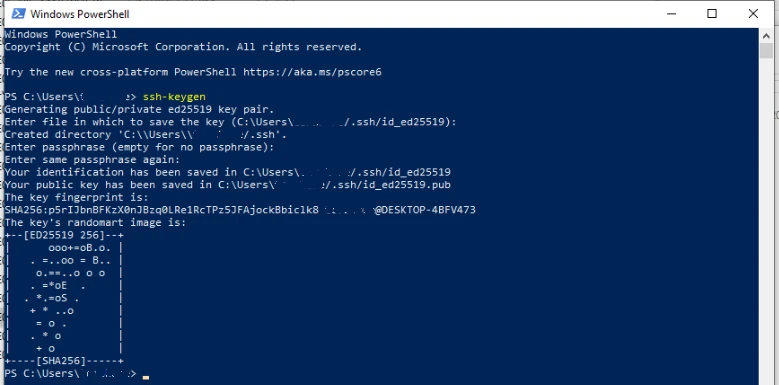
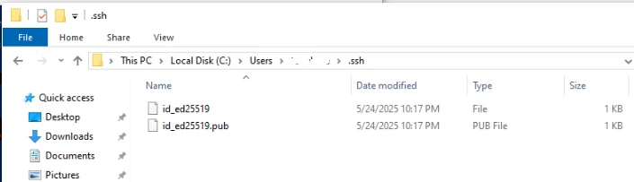
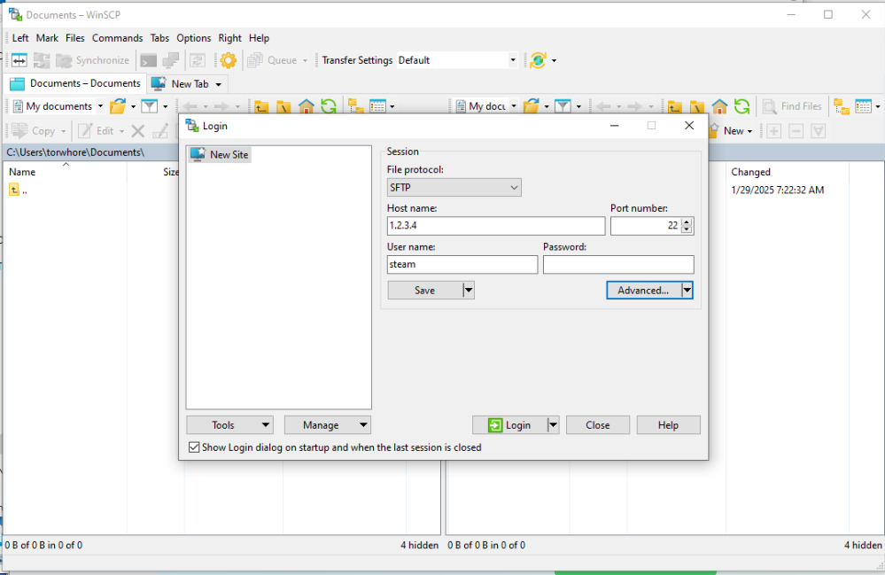
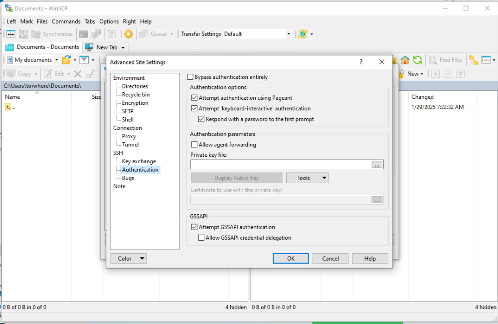
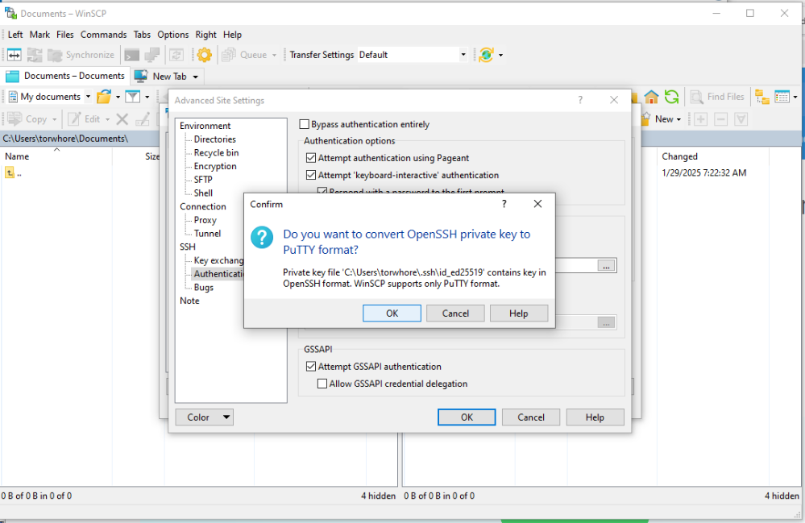
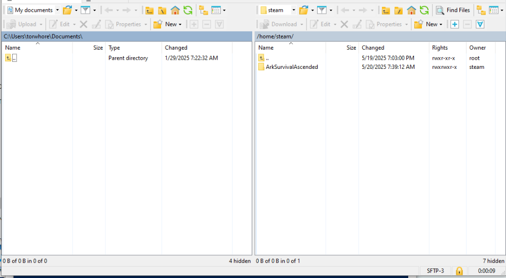

The same terminal that allows remote management of your server also supports
file transfers via a convenient GUI, and as of Windows 10 is built into the OS.

_only took them a few decades to get this added..._

This guide will offer 2 options; one is easy but less secure and the other takes a few more steps
but offers better security.

## Option 1: Use Password Authentication

As ad admin/root user on your server, run the following command to set a password for the steam user:

```bash
sudo passwd steam
```

Take note of the password you set; you will enter that in WinSCP in the next step.


## Option 2: Key Pair

### Generate Key Pair

First step is to generate a public and private key pair.
Open Powershell and run:

```powershell
ssh-keygen
```



This will generate two files, `id_ed25519` and `id_ed25519.pub` within .ssh in your home directory.



The `.pub` is the public key to be uploaded to the server and is just a text file.  Open it with notepad
or run the following command to view and copy it to your clipboard:

```powershell
Get-Content $HOME\.ssh\id_ed25519.pub
```

### Install Public Key

Then from a root or admin terminal on your server, paste the public key into the `authorized_keys` file:

```bash
sudo nano /home/steam/.ssh/authorized_keys
```

(Note, this directory will exist as of build 2025.05.25, but prior versions may need to manually create it:)

```bash
sudo mkdir -p /home/steam/.ssh
sudo touch /home/steam/.ssh/authorized_keys
sudo chmod 700 /home/steam/.ssh
sudo chown -R steam:steam /home/steam/.ssh
sudo chmod 600 /home/steam/.ssh/authorized_keys
```

## Setup Client

While Windows has native support for SSH, Microsoft sadly does _not_ provide a native GUI
for accessing SFTP files.  Two common options are Filezilla and WinSCP.

We recommend WinSCP as it is published under the GPL and therefore the source
code can be audited for security.

### Install WinSCP

Download the official client from https://winscp.net/eng/download.php
or their GitHub page and install.  You will have the option of `Commander` or `Explorer` styles.

Commander is a two-pane view with local files on one side and remote files on the other.

Explorer is a more traditional Windows file explorer style with a single pane being used for viewing remote files.
You can drag/drop files between the explorer pane and your local desktop or files.

### Connect to Server

Once installed open WinSCP and you will be presented with a login screen for a new connection.
Add your IP address, enter `steam` as the username, and ensure that `SFTP` is selected.



If you chose to use password authentication, enter the password and skip to `Save Connection`.

### Key File Setting

When using key pair authentication, leave the password blank and click on `Advanced`.  
Scroll down to `SSH` and select `Authentication`.



Browse to your private key (C:/Users/YourUserName/.ssh/id_ed25519) and select it.
Note, this is **NOT** the `.pub` file, but is the file without that .pub extension.

WinSCP will complain that the key is in the wrong format, but provides a button to auto-convert it.



Just accept that and save the private key in the format WinSCP wants.

OK through that and close to the login screen.

### Save Connection

Save the connection as something you will remember and click `Login` to attempt to connect to the server.

If everything was done correctly, you will be presented with a warning
that the server is unknown.  This is expected as you have never connected to it before.

Go ahead and accept that and you should be presented with a file browser



Once connected, you can browse through files, download, upload, and edit whatever you need.
