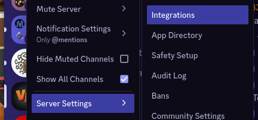
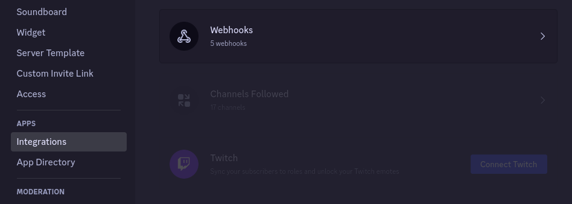
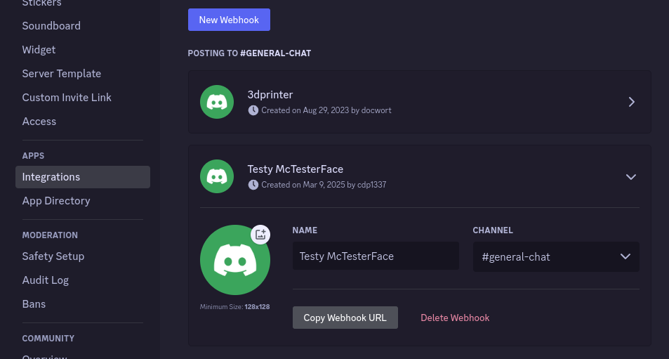

Discord integration allows your server to send notifications automatically
to a Discord channel upon server start and stop.
This allows your community to stay informed about server status
and when the map is back online after a restart.

To setup Discord integration, grab a webhook URL from Discord by browsing to
Server Settings -> Integrations



Then Webhooks



And create a new webhook and configure as desired.



Copy the webhook URL and switch back to the management console.
From the main menu, enter **d** to access the Discord integration settings.

```
== Welcome to the ARK Survival Ascended Linux Server Manager ==

Find an issue? https://github.com/cdp1337/ARKSurvivalAscended-Linux/issues
Want to help support this project? https://ko-fi.com/Q5Q013RM9Q

| # | Map              | Session                         | Port | RCON  | Auto-Start | Service | Players |
|---|------------------|---------------------------------|------|-------|------------|---------|---------|
| 1 | Extinction_WP    | Test VN Behind NAT (Extinction) | 7706 | 27006 | Disabled   | Stopped | N/A     |
| 2 | ScorchedEarth_WP | Test VN Behind NAT (Scorched)   | 7704 | 27004 | Disabled   | Stopped | N/A     |
| 3 | TheIsland_WP     | Test VN Behind NAT (Island)     | 7701 | 27001 | Disabled   | Stopped | N/A     |
| 4 | TheCenter_WP     | Test VN Behind NAT (TheCenter)  | 7705 | 27005 | Disabled   | Stopped | N/A     |
| 5 | Aberration_WP    | Test VN Behind NAT (Aberration) | 7702 | 27002 | Disabled   | Stopped | N/A     |
| 6 | BobsMissions_WP  | Test VN Behind NAT (Club)       | 7703 | 27003 | Disabled   | Stopped | N/A     |
| 7 | Astraeos_WP      | Test VN Behind NAT (Astraeos)   | 7707 | 27007 | Disabled   | Stopped | N/A     |

1-7 to manage individual map settings
Configure: [M]ods | [C]luster | [A]dmin password/RCON | re[N]ame | [D]iscord integration
Control: [S]tart all | s[T]op all | [R]estart all | [U]pdate
or [Q]uit to exit
```


```
== Discord Integration ==

Discord has not been integrated yet.

If you would like to send shutdown / startup notifications to Discord, you can
do so by adding a Webhook (Discord -> Settings -> Integrations -> Webhooks -> Create Webhook)
and pasting the generated URL here.

URL or just the character "b" to go [B]ack.
: 
```

Paste the webhook URL into the management console to enable this feature.