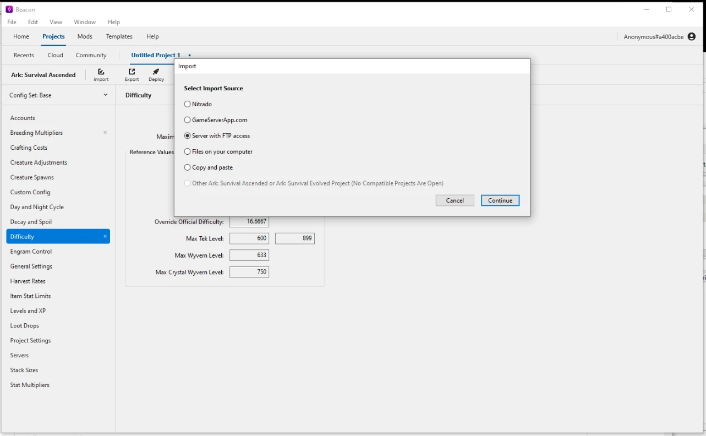
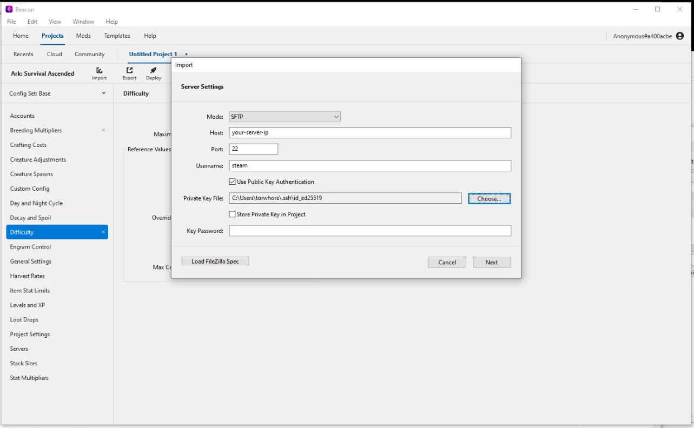
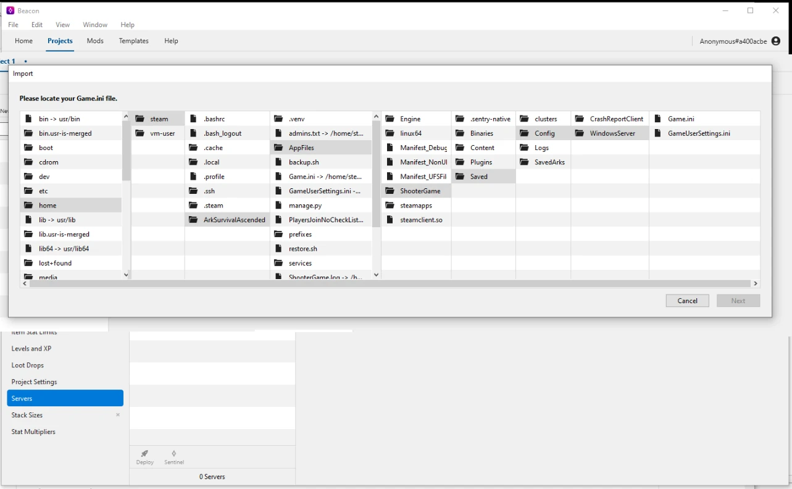
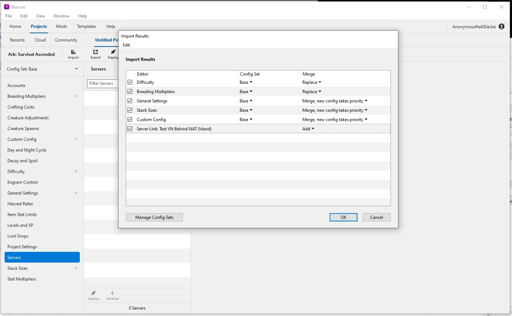
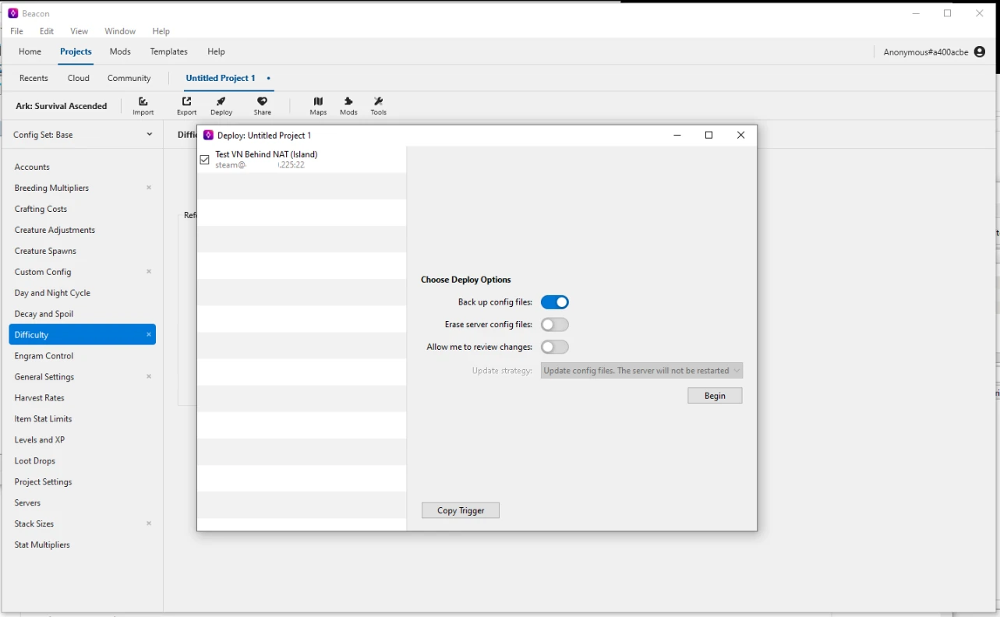

This installation script provides a vanilla installation of the game server,
so configuration management applications such as [Beacon](https://usebeacon.app/)
can be used with minimal effort.

## Step 1 - Setup SSH

Beacon will upload configuration files via SFTP upon deployment, 
so setting up your SSH connection is a prerequisite first step.

[Follow the SFTP setup guide](access-files-sftp.md) to configure SSH access
for the steam user to your server.  (WinSCP is not required for Beacon, but can be useful for testing.)

Beacon supports both password and key-based authentication, (though for security reasons,
key-based authentication is recommended.)

## Step 2 - Install Beacon

[Install Beacon from the official website](https://usebeacon.app/download).

Beacon is meant to be run on your local computer, not on the server itself,
and unfortunately only supports Windows and MacOS.

## Step 3 - Import Source

Click 'Import' to start the server add process.
Select 'Server with FTP access' (although we will be using SFTP).

On the next screen, change **Mode** to 'SFTP', enter your server's IP address,
SSH port (default is 22), and the username `steam`.

When using key-based authentication, check 'Use Public Key Authentication'
and browse for your private key (eg: C:\Users\YourUserName\.ssh\id_ed25519).

When using password authentication, just enter the password you set for the steam user.

On the next screen, browse to

1. home
2. steam
3. ArkSurvivalAscended
4. AppFiles
5. ShooterGame
6. Saved
7. Config
8. WindowsServer

and select the `Game.ini` file.

On the next screen, select what to import, (probably everything), and finish the import.

## Step 4 - Profit!

That's it!  Beacon will now be configured to push configuration changes to your server
by clicking **Deploy**.

## Caveats

Beacon manages the default `Game.ini` and `GameUserSettings.ini` for all maps.
This means that configuration changes will be applied to **all** maps at once.

It's best to stop any map prior to deploying changes, just to ensure that your changes
do not get overwritten by the game server when it shuts down.

Individual map settings specified from the management console **will** override
any setting done within Beacon.  This is notable for the **Server Name** and **Admin Password**
as they are defined by the default install, but most configuration options can also be set
from the management console to override Beacon's default deployed settings.

For example, if `DifficultyOffset` is set to 1.0 in Beacon but a specific map
is configured with `?DifficultyOffset=5.0` from the management console, that one map
will have the higher difficulty offset while all other maps will use the default.